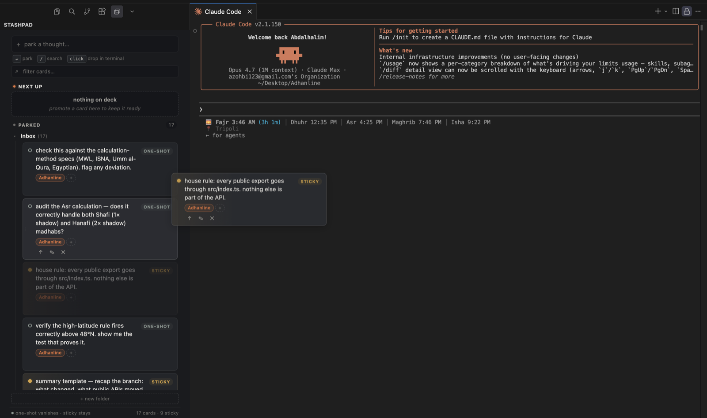

# StashPad

> Stage prompts and ideas while Claude Code works the terminal. Drop one in when the moment's right — editable text, no queue, no auto-send.

[](https://github.com/abdalhalimalzohbi/StashPad/actions/workflows/ci.yml)
[](./LICENSE)
[](https://code.visualstudio.com)



## Why not just use Claude's queue?

A queue is **linear**. Real prompting **branches**. One ask spawns tweaks, re-explains, side-quests into bugs — and you can't predict any of that when you queue.

StashPad is the **staging area in between**. While Claude grinds on something in the terminal, you park whatever crosses your mind — half-formed asks, related ideas, follow-up tweaks, edge cases you want to come back to. Cards sit on the side. When the conversation calls for one, you click it. The text lands at the cursor of the active terminal — **editable**, no `\n`, no auto-submit. You decide the order. You press Return.

It's a stage of thoughts and ideas, not a pipeline you commit to up-front.

---

## Table of contents

- [Why not just use Claude's queue?](#why-not-just-use-claudes-queue)
- [Highlights](#highlights)
- [Install](#install)
- [How it works](#how-it-works)
- [Folders & tags](#folders--tags)
- [Filter & search](#filter--search)
- [Shortcuts](#shortcuts)
- [Commands](#commands)
- [Development](#development)
- [Contributing](#contributing)
- [License](#license)

## Highlights

- **Two-zone pad** — *Next Up* (on-deck) and *Parked* (scratch tray).
- **One-shot or sticky cards** — one-shots vanish after a click, stickies stay forever.
- **Folders** — single-level groups inside Parked with drag-between, rename, and collapse. **Inbox** always exists.
- **Tags** — free-form, multiple per card. Click any pill to filter the pad. Workspace name auto-applied as a non-removable system tag.
- **Click to inject** — text lands at the cursor of the active terminal via a single `sendText(text, false)` call. No `\n`, no `term.show()` stealing focus.
- **Drag to inject** — drop a card anywhere outside the sidebar to send its text to the terminal.
- **Quick capture** — `Cmd/Ctrl + Alt + S` parks the editor selection. `Cmd/Ctrl + Alt + V` parks the clipboard.
- **Search & filter** — press `/` to focus the filter input, click tag chips to scope the view.
- **Per-workspace storage** — every workspace has its own pad. Nothing crosses projects unless you want it to.

## Install

### From a `.vsix`

1. Build (or grab the artifact from a CI run):

   ```bash
   npm install
   npm run package
   ```

2. In VS Code: `Extensions` → `…` → `Install from VSIX...` → pick the produced `stashpad-<version>.vsix`.
3. `Developer: Reload Window`.

### From a clone

Run the extension under the VS Code debugger (see [Development](#development)).

## How it works

StashPad lives in its own sidebar in the Activity Bar. The capture input at the top stashes a thought with one keystroke (`Enter`). New cards land at the top of **Parked → Inbox** as one-shots.

- Click a card → the text drops into the **active terminal** at the cursor. No `Return` is pressed for you.
- A **one-shot** card disappears after one inject (hollow dot, `ONE-SHOT` chip).
- A **sticky** card stays forever (filled dot, `STICKY` chip). Click the dot or chip to toggle between them.
- Promote a card to **Next Up** to keep it ready in the on-deck slot.
- Drag a card within the same folder/zone to reorder, drop it onto another folder to move it.
- Drag a card **out of the sidebar** — onto the terminal or the editor — and StashPad still routes its text to the active terminal via the same inject path.

## Folders & tags

- **Folders** are single-level collapsible sections inside Parked. `+ new folder` to add; hover a folder header for ✎ rename and ✕ delete (deleted folders return their cards to Inbox).
- **Tags** are free-form labels. Click `+` on a card to add one. Click any tag pill to filter the pad to cards sharing that tag.
- The **project auto-tag** is the workspace name. It's added to every new card and can't be removed — so cards from different projects don't pollute each other's view.

## Filter & search

The filter bar lives directly under the capture input.

- Press `/` from anywhere in the sidebar to focus it.
- Type → cards filter live; zone and folder counts switch to `visible / total`.
- Click a tag pill on any card to scope the view to that tag.
- Active filters appear as chips with `×` removers, plus a `clear all` link.
- `Esc` while focused on the filter clears it.

## Shortcuts

| Shortcut | Action |
|---|---|
| `Cmd/Ctrl + Alt + P` | Focus capture (reveals StashPad if hidden) |
| `Cmd/Ctrl + Alt + S` | Park the current editor selection (in editor) |
| `Cmd/Ctrl + Alt + V` | Park the clipboard contents |
| `Enter` (in capture) | Park the thought |
| `/` | Focus the filter / search input |
| `Esc` (in search) | Clear the filter |
| Click a card | Drop its text into the active terminal |
| Drag a card | Drop its text wherever (terminal, editor, anywhere) |

Remap any of them via `Cmd/Ctrl + K, Cmd/Ctrl + S` → search "stashpad".

## Commands

| Command | Purpose |
|---|---|
| `StashPad: Focus Capture Input` | Reveal StashPad and focus the capture field. |
| `StashPad: Park Selection` | Stash the current editor selection (auto-tagged with language and project). |
| `StashPad: Park Clipboard` | Stash the clipboard contents. |
| `StashPad: Test Inject` | Diagnostic — sends `hello from stashpad` to verify the inject path. |

## Development

Prereqs: Node 20+, npm 10+, VS Code 1.85+.

```bash
git clone https://github.com/abdalhalimalzohbi/StashPad.git
cd stashpad
npm install
npm run watch
```

Open the repo in VS Code → press `F5` to launch an **Extension Development Host** with StashPad loaded. Reload the host window after rebuilds (`Developer: Reload Window`).

Common scripts:

```bash
npm run typecheck   # host + webview
npm run lint
npm run format
npm run build       # one-off
npm run package     # produces a .vsix
```

See [CONTRIBUTING.md](./CONTRIBUTING.md) for architecture rules, commit format, and PR checklist.

## Contributing

Issues, ideas, and pull requests are welcome. Start with the templates under [`.github/ISSUE_TEMPLATE/`](./.github/ISSUE_TEMPLATE) and read [CONTRIBUTING.md](./CONTRIBUTING.md).

Security issues: see [SECURITY.md](./SECURITY.md).

## License

[MIT](./LICENSE) © abdalhalimalzohbi
